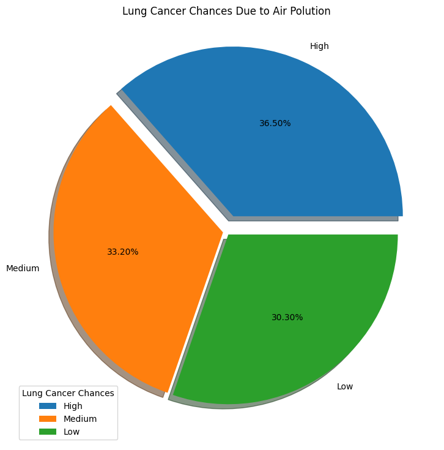
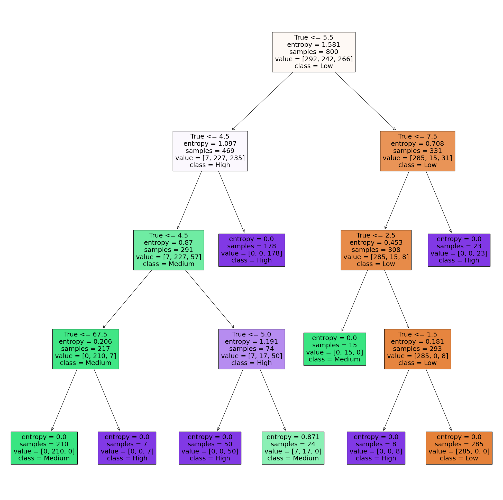

# Laporan Proyek Machine Learning
### Nama : Abriel salsabina p.y
### Nim : 211351001
### Kelas : Pagi B

## Domain Proyek
Proyek ini bertujuan untuk melakukan prediksi dan analisis terkait kanker paru-paru. Data yang digunakan mencakup informasi tentang pasien, termasuk riwayat medis, faktor-faktor risiko, dan gejala yang dialami. Tujuan dari proyek ini adalah untuk mengembangkan model prediksi yang dapat membantu dalam menentukan tingkat keparahan kanker paru-paru pada pasien. Analisis ini bertujuan untuk memahami faktor-faktor yang berkontribusi terhadap risiko kanker paru-paru, serta memprediksi tingkat keparahan berdasarkan data pasien. Hasil dari proyek ini dapat membantu dalam diagnosis dini dan perencanaan perawatan pasien kanker paru-paru.

## Business Understanding
Pada tahap ini, kita perlu memahami aspek-aspek penting dari penyakit kanker paru-paru, termasuk faktor-faktor risiko yang berkontribusi terhadap kemunculan penyakit ini, serta gejala-gejala yang mungkin dialami oleh pasien. Selain itu, penting untuk mengetahui bagaimana informasi medis dan data pasien dapat digunakan untuk memprediksi tingkat keparahan kanker paru-paru. Proyek ini memiliki tujuan untuk mengembangkan model prediksi yang akurat untuk membantu dalam diagnosis dini dan penentuan tingkat keparahan kanker paru-paru pada pasien. Analisis ini bertujuan untuk memahami kontribusi faktor-faktor risiko terhadap penyakit, serta cara efektif dalam meramalkan tingkat keparahan berdasarkan data pasien. Hasil dari proyek ini diharapkan akan membantu dalam perencanaan perawatan yang lebih baik dan memberikan manfaat nyata bagi pasien yang terkena penyakit kanker paru-paru.

### Problem Statements
- Mengembangkan model prediksi yang dapat memprediksi tingkat keparahan kanker paru-paru pada pasien berdasarkan data medis dan faktor-faktor risiko, dengan tujuan untuk diagnosis dini dan perencanaan perawatan yang lebih efektif. 

 ### Goals
 - Tujuan dari proyek ini adalah untuk mengembangkan model prediksi yang akurat untuk menentukan tingkat keparahan kanker paru-paru pada pasien. Model ini akan digunakan untuk diagnosis dini, membantu dalam perencanaan perawatan yang lebih efektif, dan meningkatkan pemahaman tentang faktor-faktor risiko yang berkontribusi terhadap penyakit kanker paru-paru.

  ### Solution statements
Pengembangan model prediksi yang menggunakan data medis dan faktor-faktor risiko pasien untuk memprediksi tingkat keparahan kanker paru-paru. Model ini akan menggunakan algoritma machine learning dan data pasien untuk memberikan hasil prediksi yang akurat. Solusi ini bertujuan untuk memberikan kontribusi positif dalam upaya diagnosis dini dan perawatan yang lebih baik bagi pasien yang terkena penyakit kanker paru-paru."

  ## Data Understanding
  Tahap ini memberikan fondasi analitik untuk sebuah penelitian dengan membuat ringkasaan (summary) dan mengidentifikasi potensi masalah dalam data. Dari data yang telah diambil mengenai Lung Cancer Prediction.

  https://www.kaggle.com/datasets/thedevastator/cancer-patients-and-air-pollution-a-new-link/data

  ### Variabel-variabel pada Europe bike store sales adalah sebagai berikut:    
 1. Patient_Id = object
 2. Age = int64 
 3. Gender = int64 
 4. Air_Pollution = int64 
 5. Alcohol_use = int64 
 6. Dust_Allergy = int64 
 7. OccuPational_Hazards = int64 
 8. Genetic_Risk = int64 
 9. chronic_Lung_Disease = int64 
 10. Balanced_Diet = int64 
 11. Obesity = int64 
 12. Smoking = int64 
 13. Passive_Smoker = int64 
 14. Chest_Pain = int64 
 15. Coughing_of_Blood = int64 
 16. Fatigue = int64 
 17. Weight_Loss = int64 
 18. Shortness_of_Breath = int64 
 19. Wheezing = int64 
 24. Snoring = int64 
 25. Level = object
 
## Data Preparation
### Data Collection

Data ini merupakan koleksi informasi medis yang berharga yang mencakup riwayat penyakit, faktor-faktor risiko, dan gejala pasien. Data tersebut dikumpulkan dari catatan medis pasien di berbagai lembaga medis dan rumah sakit. Data ini berperan penting dalam upaya diagnosis dini dan pemahaman faktor-faktor yang berkontribusi terhadap penyakit kanker paru-paru.

### Data Discovery And Profiling
Pertama-tama kita harus mengimport library-library yang dibutuhkan 
``` bash
import numpy as np
import pandas as pd
from sklearn.model_selection import  train_test_split
from sklearn.tree import DecisionTreeClassifier
from sklearn.metrics import accuracy_score
from sklearn import tree
import matplotlib.pyplot as plt
```
lanjut dengan memasukan dataset dan untuk melihat 5 data di urutan paling atas
```bash
df = pd.read_csv("cancer_patient.csv")
df.head()
```
melihat type data yang digunakan
``` bash
df.info()
```
mempreparasi data
``` bash
independen = [col for col in df.columns != 'Level']
defenden = 'Level'
```
metransformasi data atau memisahkan numerik dan kategori
Dengan cara ini, code tersebut melakukan preprocessing data dengan mengisi nilai yang hilang sesuai dengan karakteristik data numerik atau kategorikal, yaitu dengan median untuk data numerik dan modus untuk data kategorikal.
``` bash
numerical = []
catgcols = []

for col in df.columns:
if df[col].dtype == 'float64':
numerical.append(col)
elif df[col].dtype == 'int64':
numerical.append(col)
else:
catgcols.append(col)

for col in df.columns:
if col in numerical:
df[col].fillna(df[col].median(), inplace=True)
else:
df[col].fillna(df[col].mode()[0], inplace=True)
```
disini kita akan melakukan pemisahan data untuk membuat model prediksi
``` bash
X = df.drop(columns=['Level', 'index', 'Frequent_Cold', 'Snoring'], axis=1)
Y = df['Level']
x_train, x_test, y_train, y_test = train_test_split(X, Y, test_size=0.2, stratify=Y, random_state=2)
print(X.shape, x_train.shape, x_test.shape)
```

lalu kita akan membuat sebuah objek DecisionTreeClassifier, yang merupakan model pohon keputusan untuk tugas klasifikasi.
``` bash
desicion = DecisionTreeClassifier(
    ccp_alpha=0.0, class_weight=None, criterion='entropy',
    max_depth=4, max_features=None, max_leaf_nodes=None,
    min_impurity_decrease=0.0, min_samples_leaf=1,
    min_samples_split=2, min_weight_fraction_leaf=0.0,
    random_state=42, splitter='best'
)
model = desicion.fit(x_train, y_train)
```

selanjutnya kita akan mengukur akurasi dari model yang kita gunakan
``` bash
x_train_predict = model.predict(x_train)
training_data_accuracy = accuracy_score(x_train_predict, y_train)

x_test_predict = model.predict(x_test)
test_data_accuracy = accuracy_score(x_test_predict, y_test)
print('Akurasi data testing : ', test_data_accuracy)
```
Code program ini digunakan untuk membuat grafik pie (pie chart) yang menggambarkan peluang kanker paru-paru berdasarkan tingkat polusi udara.Hasilnya adalah grafik pie yang menggambarkan proporsi dari tingkat polusi udara yang berkontribusi terhadap peluang terkena kanker paru-paru.
``` bash
plt.figure(figsize = (11, 9))
plt.title("Lung Cancer Chances Due to Air Polution")
plt.pie(df['Level'].value_counts(), explode = (0.1, 0.02, 0.02), labels = ['High', 'Medium', 'Low'], autopct = "%1.2f%%", shadow = True)
plt.legend(title = "Lung Cancer Chances", loc = "lower left")
```
 <br>

Code program ini digunakan untuk membuat dan menampilkan visualisasi pohon keputusan (decision tree).
``` bash
fig = plt.figure(figsize=(25, 25))
_ = tree.plot_tree(
model,
feature_names = independen,
class_names = ['Low', 'Medium', 'High'],
filled = True)
```
 <br>

Code program ini  digunakan untuk memprediksi tingkat keparahan kanker paru-paru berdasarkan data masukan.
``` bash
input_data = (1,17,1,3,1,5,3,4,2,2,2,2,4,2,3,1,3,7,8,6,2,7)
input_data_numpy = np.asarray(input_data)
data_reshaped = input_data_numpy.reshape(1, -1)
prediksi = model.predict(data_reshaped)
print(prediksi)

if (prediksi[0] == 0):
print('Keparahan Kanker Paru-Paru Pasien Berada di Tingkat Tinggi')
elif(prediksi == 2):
print('Keparahan Kanker Paru-Paru Pasien Berada di Tingkat Sedang')
else:
print('Keparahan Kanker Paru-Paru Pasien Berada di Tingkat Rendah')
```


## Deployment

  [App](https://pembelajaranmesin-lgvbhzfkthzbmshpdbz7tx.streamlit.app/)